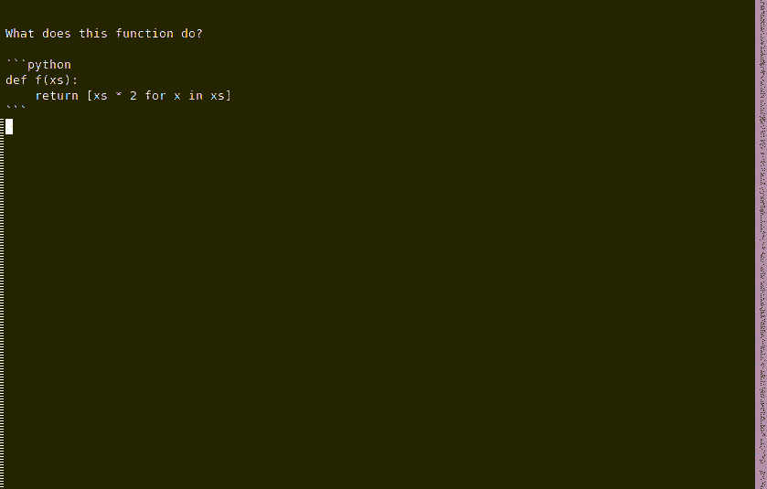

# LLM Pal

Write alongside an AI, right in your editor, via an LSP tied to local/cloud AIs.

A hackable implementation that lets you roll-your-own prompt-engineering/custom models/plug into other tools etc.

It is tested with Emacs, but the LSP Server should work on most editors. More editors to come!


## The Goods



Right now this is set up to work automatically on `.llm` files only, because Eglot cannot run multiple LSPs in parallel. So if you use a python LSP, this won't work in conjunction. This will be an easy fix eventually.


## Setup

This currently supports Emacs (but I would love to add support for more editors).

For emacs, I've only tried with `eglot` so far, since `lsp-mode` doesn't support a connection over TCP. The connection over TCP makes it more convenient for relaunching the server by hand during development.

So, the steps to run:

### 1. Setup emacs's `init.el`

Clone this repo and then link to it in your `init.el`. Update the `'load-path` to link to this repo.

```lisp
(use-package eglot
  :ensure t
  :hook
  (eglot--managed-mode . company-mode)
  :init
  (setq eglot-confirm-server-initiated-edits nil)
  :config
  (define-key eglot-mode-map (kbd "M-'") 'eglot-code-actions))

(add-to-list 'load-path (expand-file-name "/home/path/to/llmpal/"))

(require 'llm-mode)

(use-package llm-mode
  :ensure nil
  :mode ("\\.llm\\'" . llm-mode)
  :hook (llm-mode . eglot-ensure))
```

Optional add some nice keybindings. See [`doc/example_eglot_config.el`](./doc/example_eglot_config.el):

```
...
(add-hook 'llm-mode-hook
          (lambda ()
            (define-key llm-mode-map (kbd "C-c l g") 'eglot-code-action-openai-gpt)
            (define-key llm-mode-map (kbd "C-c l c") 'eglot-code-action-openai-chatgpt)
            (define-key llm-mode-map (kbd "C-c l l") 'eglot-code-action-local-llm)
            (define-key llm-mode-map (kbd "C-c C-c") 'eglot-code-action-local-llm)
            (define-key llm-mode-map (kbd "C-c l s") 'eglot-code-action-stop-local-llm)
            (eglot-ensure)))
```


### 2. Run the LSP Server

```
pip install -r requirements.txt

python lsp_server.py
```

### 3. Optional: Run the local LLM server

```
uvicorn llm_server:app --port 8000
```

This reads your `config.yml` (example is in the repo) to find a Transformers-compatible model, eg Falcon, and will run it.

I imagine if you point at the dir of any Transformers-compatible model, this should work.

### 4. Give it a go.

**Keycombos**

If you followed this installation procedure exactly, here are your keycombos:

| Keycombo | Effect                                           |
|:---------|:-------------------------------------------------|
| M-'      | Show Code Actions Menu                           |
|          |                                                  |
| C-c l g  | Send region to GPT, stream output to text buffer |
| C-c l c  | Same, but ChatGPT                                |
| C-c l l  | Same, but local (eg Falcon) model                |
| C-c C-c  | Same as `C-c l l` but quicker to hit             |
|          |                                                  |
| C-c l s  | Whatevers streaming, stop it                     |


## Misc

### Emacs: Eglot vs LSP-mode?

Eglot is currently supported.

|                     | LSP  | Eglot   |
|:--------------------|:-----|:--------|
| Multiple Servers    | yes  | no      |
| Speed               | ok   | fast    |
| Features            | many | minimal |
| Debug Adapter Proto | yes  | no      |
| Work over TCP       | no   | yes     |
|                     |      |         |

- Some users report LSP-mode is tougher to get working, and buggier.

- I've started with `eglot` because of the TCP capacity. It's easier to test changes if I can restart a server by hand.


### VSCode

Someone please help write some example configuration!


### TODO

- [ ] support VSCode and other editors
- [ ] Add ability to work in any buffer with any LSP. Eglot can't handle multi LSPs, but LSP-mode should be able. The issue with LSP-mode is I don't think it supports working over TCP, so reloading the server in dev env is annoying.
- [ ] How should we package this up more nicely?
